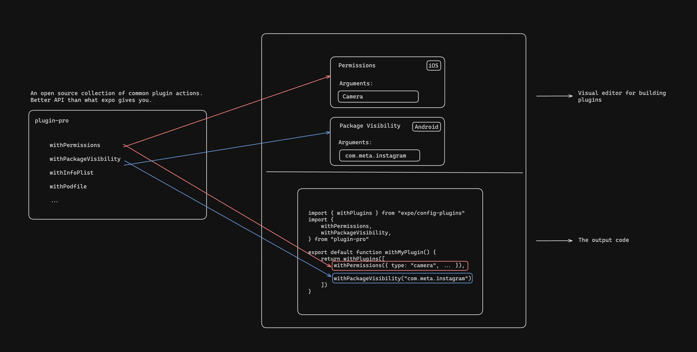

# Plugin Pro

## What is it?

An open source collection of common plugin actions. Fully typed.

## How it works



## API

### `withColorValue` 🤖

Adds a color value to the project.

```javascript
withColorValue(config, {
  name: "primaryColor",
  value: "#000000",
  colorScheme: "dark",
});
```

### `withAndroidManifest` 🤖

Modify the AndroidManifest.xml file.

```javascript
withAndroidManifest(config, {
  $: { "xmlns:android": "http://schemas.android.com/apk/res/android" },
  queries: [{ intent: "" }],
  permission: [{ $: { "android:name": "" } }],
});
```

### `withStringValue` 🤖

Adds a string value to the project.

```javascript
withStringValue(config, {
  name: "stringName",
  value: "Hello, world!",
  translatable: true,
});
```

### `withEntitlements` 🍎

Adds an entitlment to your app, allowing it to access a feature on the device.

```javascript
withEntitlements(config, {
  key: "com.apple.developer.healthkit.access",
  value: "yes",
});
```

### `withInfoPlist` 🍎

Adds a key/value pair to the Info.plist file.

```javascript
withInfoPlist(config, {
  key: "NSHealthShareUsageDescription",
  value: "We need access to your health data.",
});
```

### `withModifyFile` 🤖 🍎

Modify a file by finding and replacing a string.

```javascript
withModifyFile(config, {
  filePath: "AppDelegate.m",
  find: "something",
  replace: "something else",
});
```

Or insert a string at a specific anchor and offset.

```javascript
withModifyFile(config, {
  filePath: "AppDelegate.m",
  newSrc: "hello",
  anchor: "something",
  offset: 10,
});
```

### `withSourceFile` 🤖 🍎

Apply modifications to a source file.

```javascript
withSourceFile(config, {
  filePath: "AppDelegate.m",
});
```

### `withResourceFile` 🤖 🍎

Add a resource file to the project.

```javascript
withResourceFile(config, {
  filePath: "android/src/main/res/values/strings2.xml",
});
```

### `withRemoveFile` 🤖 🍎

Remove a file from the project.

```javascript
withRemoveFile(config, {
  filePath: "path/to/file",
});
```

### `withPlugins` 🤖 🍎

Apply multiple plugins to the project.

```javascript
withPlugins(config, [
  [withEntitlement, { key: "aps-environment", value: "development" }],
  [
    withColorValue,
    { name: "primaryColor", value: "#000000", colorScheme: "dark" },
  ],
]);
```
